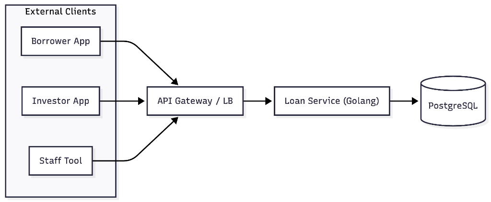

# RFC: Loan Service - System Design and Abstraction

This document outlines the proposed design for the core Loan Engine, focusing on state management, validation rules, the RESTful API interface, and **robust concurrency handling** to safely manage simultaneous investments.

## 1. Overview
The Loan Engine manages the lifecycle of a loan from its initial proposal through approval, investment, and final disbursement. All state transitions are forward-moving only.

### Out of Scope
- **Rate Limiting**: To avoid over-engineering with external dependencies like Redis for this take-home test, strict API rate limiting (e.g., token bucket) is out of scope. However, I am fully aware of its critical importance for preventing brute-force attacks and abuse in a production environment.
- **Asynchronous Messaging**: Distributing agreement letters via a message queue (e.g., Kafka or RabbitMQ) is out of scope. A simple goroutine is used instead to avoid adding heavy infrastructure requirements to the reviewer's local setup.
- **Repayment Processing**: The logic for borrower repayments is not covered in this RFC.
- **Interest Distribution**: Automatic distribution of interest to investors during repayments is out of scope.
- **Authentication & Authorization**: A secure Identity and Access Management (IAM) flow using JWTs or Sessions is not implemented. API parameters directly rely on User IDs for simplicity in this scope.

## 2. Database Schema

### `users`
> [!NOTE]
> This table is managed by the **User Service (External)**. It is included here for context to define how `investor` and `borrower` roles are distinguished via the `type` column.

| Column | Type | Description |
|---|---|---|
| `id` | BigSerial | Internal primary key. |
| `mask_id` | UUID | External unique identifier. |
| `name` | String | Full name of the user. |
| `username` | String | Unique username for login. |
| `password` | String | Hashed password. |
| `type` | Enum | `investor` or `borrower`. |
| `created_at` | Timestamp | Date of user registration. |

**Constraints:**
- `UNIQUE(mask_id)`
- `UNIQUE(username)`

### `loans`
| Column | Type | Description |
|---|---|---|
| `id` | BigSerial | Internal primary key (clustered index). |
| `loan_number` | String | Unique short identifier (e.g., NanoID) for user-facing interactions. |
| `borrower_id` | BigInt | refer to `users.id` (The borrower). |
| `description` | String | Description or purpose of the loan. |
| `principal_amount` | Decimal | Total amount requested. |
| `rate` | Decimal | Interest rate for the borrower. |
| `roi` | Decimal | Return of Investment for investors. |
| `status` | Enum | `proposed`, `approved`, `invested`, `disbursed`. |
| `total_invested` | Decimal | Running sum of investments. |
| `approved_at` | Timestamp | Date of approval. |
| `approved_by_employee_id` | String | ID of the validator who visited the borrower. |
| `visit_proof_url` | String | URL to the picture proof of visit. |
| `disbursed_at` | Timestamp | Date of disbursement. |
| `disbursed_by_employee_id` | String | ID of the officer who disbursed the funds. |
| `borrower_agreement_url` | String | URL to the final agreement letter signed by the borrower (disbursement proof). |
| `created_at` | Timestamp | Date of loan proposal creation. |

**Constraints:**
- `UNIQUE(loan_number)`
- `CHECK(principal_amount > 0)`
- `CHECK(total_invested >= 0 AND total_invested <= principal_amount)`
- `CHECK(rate >= 0 AND roi >= 0)`

**Design Rationale (Semi-Flattened):**
- **Read Performance**: Aggregating loan details and audit metadata in a single row avoids multiple complex `JOIN`s, ensuring high-performance API reads.
- **Atomicity**: Managing the lifecycle within a single record simplifies transactional integrity and row-locking (`FOR UPDATE`) during critical state transitions.
- **Linear Progression**: Since a loan moves through a fixed, linear state machine, keeping audit fields in the main table is efficient and reduces system complexity compared to full normalization.

### `investments`
| Column | Type | Description |
|---|---|---|
| `id` | BigSerial | Internal primary key. |
| `loan_id` | BigInt | FK to `loans.id`. |
| `investor_id` | BigInt | refer to `users.id` (Information of the person investing). |
| `amount` | Decimal | Amount invested. |
| `status` | Enum | `process`, `paid`, `invested`, `failed`. |
| `idempotent_key` | String | Unique key to prevent double investment. |
| `agreement_letter_url` | String | URL to the system-generated agreement letter specifically for this investor. |
| `created_at` | Timestamp | Date of investment creation. |

**Constraints:**
- `UNIQUE(investor_id,idempotent_key)`
- `CHECK(amount > 0)`

**Investment Status Logic:**
- **`invested`**: The investment request was successful. Funds have been deducted, the loan's `total_invested` has been updated, and the transaction is committed atomically.

### `pockets`
Tracks separate balances for different sources of funds.
| Column | Type | Description |
|---|---|---|
| `id` | BigSerial | Internal primary key. |
| `user_id` | BigInt | refer to `users.id`. |
| `balance_investable` | Decimal | Funds that can be used for investment (top-ups, interest earnings). |
| `balance_disbursed` | Decimal | Funds received from loans (limited to withdrawal only). |

**Constraints:**
- `UNIQUE(user_id)`
- `CHECK(balance_investable >= 0)`
- `CHECK(balance_disbursed >= 0)`

### `pocket_ledger`
Tracks all financial movements (Double-entry principle).
| Column | Type | Description |
|---|---|---|
| `id` | BigSerial | Internal primary key. |
| `user_id` | BigInt | refer to `users.id`. |
| `amount` | Decimal | Transaction amount. |
| `direction` | Enum | `CREDIT`, `DEBIT`. |
| `activity_type` | Enum | `investment`, `disbursement`, `repayment`, `topup`, `withdrawal`. |
| `reference_id` | BigInt | Reference to investment/loan ID (e.g., `loan_id` or `investment_id`). |
| `created_at` | Timestamp | Transaction date. |

**Constraints:**
- `UNIQUE(user_id, activity_type, reference_id, direction)`
- `CHECK(amount > 0)`

---

## 3. State Machine & Transition Rules

Loans move strictly forward: `proposed` -> `approved` -> `invested` -> `disbursed`.

### 3.1. Proposed (Initial)
- **Trigger**: Loan application submission.
- **Actor**: Can be initiated directly by the **Borrower** via the app, or by a **Field Officer** assisting the borrower in the field.
- **Rules**: Initial state. `principal_amount`, `rate`, and `roi` must be defined.

### 3.2. Approved
- **Trigger**: Staff approval action.
- **Requirement**:
    - `approved_by_employee_id`: ID of the staff who visited the borrower.
    - `visit_proof_url`: Link to the picture proof of visit.
    - `approved_at`: Date of approval (System Generated).
- **Rule**: Cannot transition back to `proposed`. Once approved, it is open for investment.

### 3.3. Invested
- **Trigger**: Total investment amount reaches `principal_amount`.
- **Requirement**:
    - The `total_invested` on the loan exactly matches the `principal_amount` (We maintain a pre-calculated `total_invested` column to avoid expensive aggregate queries on the investments table).
    - Cannot exceed `principal_amount`.
- **Locking & Atomicity**:
    - **Pessimistic Locking**: Every investment request must perform a `SELECT FOR UPDATE` on both the **Loan** record (to prevent over-investment) and the **Investor's Pocket** (to guarantee balance integrity).
    - **Atomic Transaction**: The deduction from the pocket, the creation of the investment record, and the update of the loan's `total_invested` must occur within a single atomic database transaction.
- **Action**: Once reached, status becomes `invested` and an email is sent to all current investors containing the link to their `agreement_letter_url`.

### 3.4. Disbursed
- **Trigger**: Staff disbursement action.
- **Requirement**:
    - `disbursed_by_employee_id`: ID of the field officer handing over money/collecting signed docs.
    - `borrower_agreement_url`: Link to the signed agreement letter (PDF/JPEG).
- **Locking & Atomicity**:
    - **Pessimistic Locking**: The disbursement process must perform a `SELECT FOR UPDATE` on the **Borrower's Pocket** record to guarantee balance integrity during the funds transfer.
    - **Atomic Transaction**: The update of the loan status to `disbursed`, the addition of funds to the borrower's `balance_disbursed`, and the creation of the corresponding `pocket_ledger` entry must occur within a single atomic database transaction.

---

## 4. System Architecture

The Loan Service follows a standard backend architecture focused on simplicity and performance.



- **API Gateway / Load Balancer**: Handles SSL termination and routes requests to the Go application.
- **Investor & Borrower Apps**: Mobile or Web clients used by the public to manage loans and investments.
- **Staff Tool**: Internal interface for employees to approve and disburse loans.
- **Golang Service**: Core business logic, state machine, and transaction management. **Golang was chosen** for its natively efficient concurrency model (Goroutines), which is essential for handling high-throughput P2P lending transactions without heavy OS thread overhead.
- **PostgreSQL**: Clustered index on primary keys, supporting ACID transactions and row-level locking.

---

## 5. Internal Software Architecture (Clean Architecture)

The service is structured using Go Clean Architecture principles to ensure testability, maintainability, and separation of concerns.

### 5.1. Layer Definitions
- **Delivery (Transport)**: Handles the communication protocol (REST API handlers). Responsible for parsing requests into **Request DTOs**, validating them, and formatting **Response DTOs**. This layer ensures internal DB models never leak to the public API.
- **Usecase (Application Business Logic)**: Orchestrates the business flow (e.g., calling state machine validations, managing transactions).
- **Repository (Infrastructure / Data Access)**: Implements database operations. It "knows" about PostgreSQL and SQL queries.
- **Utils / Infrastructure (Shared)**: Contains shared bootstrap code (DB connection pool, logger, configuration loading) that can be used across layers.
- **Models / Entity (The Core)**: Contains business models (Structs) and interface definitions. This layer has **zero** dependencies on other layers.

### 5.2. Dependency Direction
Dependencies follow the **Inner Rule**:
`Delivery` -> `Usecase` -> `Repository` -> `Models`

### 5.3. Proposed Folder Structure
```text
.
├── cmd/                # Entry point (main.go)
├── constant/           # Shared constants (e.g., error.go)
├── docs/               # API Documentation (openapi.yaml)
├── internal/
│   ├── delivery/       # HTTP Transport Layer
│   │   └── http/
│   │       ├── request/  # HTTP Request DTOs
│   │       └── response/ # HTTP Response DTOs
│   ├── models/         # Database model structs & entities
│   ├── pkg/            # Shared utilities (logger)
│   ├── repository/     # SQL / DB Adapters
│   └── usecase/        # Business Logic
├── migrations/         # Database migration scripts (.sql)
├── scripts/            # Automation scripts (setup.sh)
├── .env                # Local environment variables
├── docker-compose.yml  # Docker orchestration (Postgres)
├── go.mod              # Package dependencies
└── README.md           # This document
```

---

## 6. RESTful API Design

### 6.1. Create Loan (Proposed)
`POST /api/v1/loans`
- **Context**: This endpoint is used by the Borrower app or the Staff internal tool to propose a new loan.
- **Security Note**: While `borrower_id` is provided in the body for this scope, it should ideally be extracted from the **JWT Token** in the `Authorization` header.
- **Request Body**:
```json
{
  "borrower_id": 1,
  "description": "Modal usaha toko kelontong",
  "principal_amount": 1000000.0,
  "rate": 0.12,
  "roi": 0.08
}
```
- **Response**: `201 Created` with unique `loan_number` and initial status `proposed`.

### 6.2. Approve Loan
`POST /api/v1/loans/{loan_number}/approve`
- **Security Note**: While `approved_by_employee_id` is provided in the body for this scope, it should ideally be extracted from the **JWT Token** in the `Authorization` header.
- **Request Body**:
```json
{
  "approved_by_employee_id": "EMP-789",
  "visit_proof_url": "https://cdn.example.com/v/proof-001.jpg"
}
```
- **Note**: `approved_at` is automatically generated by the system clock.
- **Constraint**: Only valid for `proposed` loans. Transitions to `approved`.

### 6.3. Invest in Loan
`POST /api/v1/loans/{loan_number}/invest`
- **Security Note**: While `investor_id` is provided in the body for this scope, it should ideally be extracted from the **JWT Token** in the `Authorization` header.
- **Request Body**:
```json
{
  "investor_id": 2,
  "amount": 500000.0,
  "idempotent_key": "unique-req-uuid-123"
}
```
- **Response**: 
    - `201 Created` with investment details and initial status `invested` (success).
    - `400 Bad Request` if there is an validation failure. The backend returns specific codes for frontend tracking/analytics (`insufficient_balance`, `fully_funded`, `investment_amount_exceed`). Database is not bloated with failed records.
    - `409 Conflict` if the `idempotent_key` has already been processed for this investor (`code: duplicate_request`). The frontend should guide the user to their investment history page.
- **Rules**:
    - Loan status must be `approved`.
    - `total_invested` + `current_amount` <= `principal_amount`.
    - **Source of Funds**: Amount must be deducted from `balance_investable`. Circular lending (using `balance_disbursed`) is prohibited.
    - If `total_invested` == `principal_amount`, status becomes `invested`.

### 6.4. Disburse Loan
`POST /api/v1/loans/{loan_number}/disburse`
- **Security Note**: While `disbursed_by_employee_id` is provided in the body for this scope, it should ideally be extracted from the **JWT Token** in the `Authorization` header.
- **Request Body**:
```json
{
  "disbursed_by_employee_id": "EMP-456",
  "borrower_agreement_url": "https://cdn.example.com/d/signed-001.pdf"
}
```
- **Response**: 
    - `200 OK` with success message.
    - `409 Conflict` if the loan has already been disbursed (`code: duplicate_request`). The frontend should guide the user to the disbursement history page
- **Constraint**: Only valid for `invested` loans. Transitions to `disbursed`.

---

## 7. Future Improvements

> [!IMPORTANT]
> This section describes architectural patterns for future scalability. These are **not** to be implemented in the current phase and are for RFC discussion only.

### 7.1. High Concurrency Strategy (The "Loan War")
For extremely high-traffic scenarios where hundreds of investors compete for the same loan simultaneously, we can move from a purely synchronous model to a hybrid **Sync & Async** approach to minimize row-locking duration:

1.  **Sync (Wallet Protection)**: Create the investment record with status `paid` and return "success" to the user immediately after the pocket deduction is confirmed.
2.  **Async (Loan Update)**: Use a background worker or message queue (e.g., Kafka) to update `loan.total_invested`. Once successfully updated, the investment status transitions from `paid` to `invested`.

This strategy significantly reduces the time the `loan` record is locked, preventing bottlenecks during popular loan launches.

---

## 8. SetUp -> Test -> Load Test

### 8.1. Running Setup
To reset the Postgres database and seed it with dummy users (borrowers & investors) and a dummy loan, run the following setup script:
```bash
chmod +x scripts/setup.sh && ./scripts/setup.sh
```

### 8.2. Swagger Interface
Once the setup is running, you can interact with the API documentation and test endpoints through the local Swagger UI:
- **[http://localhost:8081](http://localhost:8081)**

### 8.3. Running K6 Load Tests (Race Condition Mitigation)
This project includes K6 scripts to simulate concurrent bursts for both `Invest` and `Disburse` endpoints to prove the `FOR UPDATE` Row-Level Locking database strategy operates correctly without allowing over-funding or duplicate disbursements.

**Install K6 (macOS):**
```bash
brew install k6
```

**Run the Invest Load Test (3 concurrent investors):**
```bash
k6 run scripts/k6_race_invest_condition.js
```
* **Expected Outcome (Proof of Lock):** The K6 results will show 1 successful request (`200 OK`) and 2 failed requests (`400 Bad Request` or `409 Conflict`). If you check the database using `SELECT total_invested FROM loans`, it will correctly show `3000000`, proving that the `FOR UPDATE` lock prevented the other 2 investors from over-funding the loan.

**Run the Disburse Load Test (3 concurrent employees):**
```bash
k6 run scripts/k6_race_disburse_condition.js
```
* **Expected Outcome (Proof of Lock):** The K6 results will show 1 successful request (`200 OK`) and 2 failed requests. Checking the database will reveal only a single disbursement record in the `pocket_ledger`, proving that concurrent API calls cannot accidentally duplicate loan disbursements.
